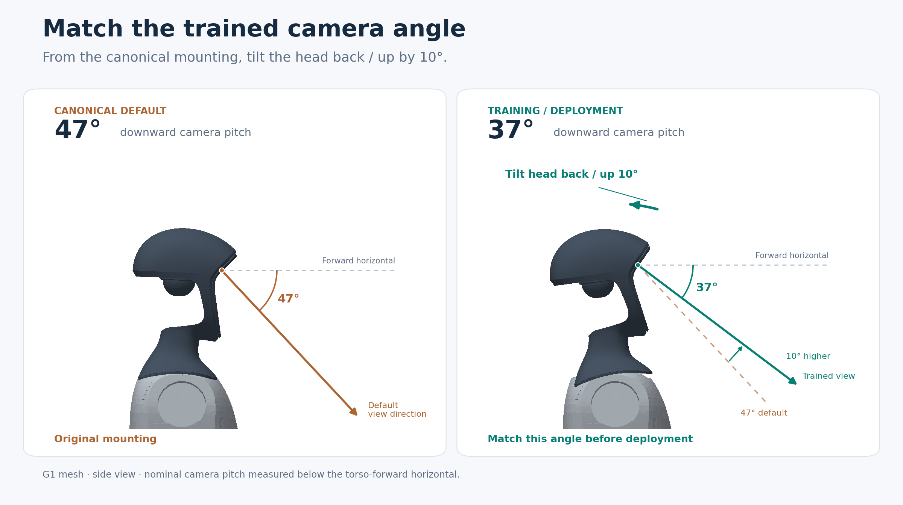

# PRISM · Sim-to-real

Deploy the student policy with **D435i stereo IR → FastFoundationStereo (FFS) → policy**.
The robot streams stereo images; an external GPU computer runs FFS and the policy.
Training and released checkpoints are on [`main`](https://github.com/amazon-far/PRISM/tree/main).

**The canonical G1 mounting has a default downward camera pitch of 47°.
Training uses 37°: tilt the head back / up by 10° from the canonical position
before deployment.** This physical adjustment aligns the camera pitch with the
depth view used during training. Angles are measured below the torso-forward horizontal.



## Install

**GPU computer:** Linux x86_64, Python 3.10, and an NVIDIA driver supporting CUDA 12.4.
On Ubuntu, the system packages are `git`, `build-essential`, `python3.10-venv`,
`python3.10-dev`, `libgl1`, `libegl1`, `libglib2.0-0` and `libusb-1.0-0`.
Python 3.10 may need to be installed separately on your distribution.

```bash
git clone --branch sim2real --recurse-submodules https://github.com/amazon-far/PRISM.git
cd PRISM
python3.10 -m venv .venv
source .venv/bin/activate
bash install.sh
```

The installer initializes the pinned FFS submodule and installs CUDA PyTorch,
FFS dependencies, pyrealsense2, OpenCV, ZeroMQ and the Unitree SDK.
The default FFS installation uses the resolved versions in `constraints-ffs.txt`.
Use a fresh environment without `--system-site-packages`, separate from the
Python 3.11 simulation environment. No pre-existing HoloSoma environment or
local CUDA toolkit is required. Run `python scripts/check_install.py` and
`python -m pip check` to verify installation without connecting to the robot.

**Robot camera host:** clone the same branch, create and activate a Python 3.10 environment,
then run `bash install.sh --relay`. This installs NumPy, pyrealsense2 and ZeroMQ;
also install the system packages `libusb-1.0-0`, `usbutils` and `psmisc`. Configure SSH access
from the GPU computer to this host.

## Run

Prepare the student **ONNX** policy and the
[C-Fast-FoundationStereo weights](https://huggingface.co/nvidia/c-fast-foundationstereo/tree/9b446878c81ddb27593036767b29b2859d46103e).
Keep `model_best_bp2_serialize.pth` and `cfg.yaml` in the same directory.
Then run on the GPU computer:

```bash
bash real_ffs.sh \
  --model /path/to/student.onnx \
  --ffs-model /path/to/ffs/model_best_bp2_serialize.pth \
  --relay-host user@camera-host \
  --relay-python /absolute/path/to/camera-env/bin/python \
  --interface eth0
```

Replace the paths, SSH host and robot network interface for your setup.
This command starts the robot's stereo relay, FFS depth and the policy.
**The robot receives hold-position commands as soon as the policy starts.**
Ctrl-C stops the session; logs are saved under `logs/`.

The FFS submodule retains its [upstream license](third_party/Fast-FoundationStereo/LICENSE.txt),
including its non-commercial use restriction; weights have their own terms.

## Security

See [CONTRIBUTING](CONTRIBUTING.md#security-issue-notifications) for security reporting.
